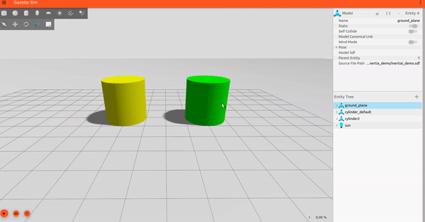
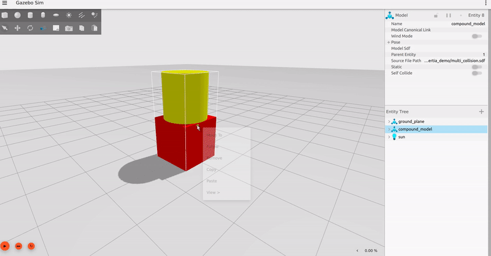
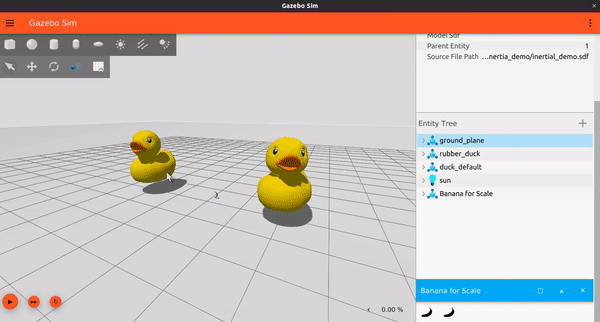
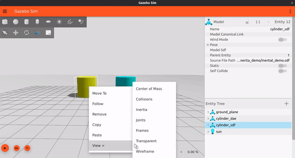

# GSoC'23 with Open Robotics

__Project: Automatically Compute Moments of Inertia for SDFormat Links__

__Mentors: Addisu Taddese (addisu@openrobotics.org), Dharini Dutia (dharinidutia@openrobotics.org)__

<p float="left">
  
  
</p>

## Overview
Setting physically plausible values for inertial parameters is crucial for an accurate simulation. However, these parameters 
are often complex to comprehend and visualize, and users may tend to enter wrong values leading to incorrect simulation. 
Therefore, native support for calculating inertial parameters through SDFormat specification would enable accurate simulations 
in simulators that use SDFormat.

Therefore, during the GSoC program this year, we have worked on implementing a feature for [libsdformat](https://github.com/gazebosim/sdformat)
that allows automatic calculation of Moments of Inertia for SDFormat links. 

This GitHub gist discusses about the motivation behind this feature and outlines the work that was done during the GSoC period.
This gist contains the following contents:
 * [Motivation behind the project](#Motivation)
 * [Project Summary alongwith some usage examples and demos](#Project-Summary)
 * [List of all PRs made and Issues opened during the period](#List-of-PRs-and-Issues)
 * [References](#References)
 * [About Me](#About-Me)

## Motivation
Currently, there are 2 major workflows used by the users to obtain the correct inertial parameters of their models:

 * Using CAD software like [Fusion360](https://www.autodesk.in/products/fusion-360/overview?term=1-YEAR&tab=subscription) or [Solidworks](https://www.solidworks.com/). Many users design their robot models using such CAD software which provides plugins that automatically generate the URDF/SDF for their model. Such plugins handle the calculation of the inertial parameters. For example, Fusion360 provides the [Fusion2URDF](https://github.com/syuntoku14/fusion2urdf) plugin which automatically generates a URDF with all the inertial parameters.

 * Another way is to use 3rd-party Mesh Processing Software like [Meshlab](https://www.meshlab.net/). Such software takes the mesh file as an input and provides the inertial parameters as an output which can then be copied and pasted into the URDF/SDF file. This is also the method that was suggested in official [Classic Gazebo docs](https://classic.gazebosim.org/tutorials?cat=build_robot&tut=inertia).

Both of these ways create a dependency on external software and might be complicated for beginners. In case the user doesn't provide any inertial values, a default Mass Matrix is used with `mass = 1.0` and `Diagonal Elements = (1, 1, 1)` which might not be best suited for all kinds of models. Native support for automatic inertia calculations directly into `libsdformat` would work as a better alternative to using the default values and facilitate the effortless generation of accurate simulations.

## Project Summary
This project proposed the addition of an `//inertial/@auto` attribute as well as a `//collision/density` element to the SDFormat Spec 1.11. This way, the **auto** attribute of the inertial element can be set to true which would allow `libsdformat` to compute the inertial values (mass, mass matrix, and center of mass) of a link using the **density** and **geometry** of its constituent collisions.

Currently, the moment of inertia calculations are supported for the following geometry types: 
 * Box
 * Capsule
 * Cylinder
 * Ellipsoid
 * Sphere
 * Mesh.

Existing `MassMatrix()` functions from the `gz-math` library were used for the inertia calculation of basic shapes (box, capsule, cylinder, ellipsoid, and sphere). This functionality was integrated within `libsdformat` itself. Since `libsdformat` depends on `gz-math`, this would allow any simulator that relies on SDFormat to provide automatic moment of inertia calculation for basic shapes out of the box.

On the other hand, a different approach was taken for the **mesh** geometry type since inertia calculations for 3D meshes can be complex and the preference for calculation method could vary for different users. A callback-based API was created that allows users to register their own custom inertia calculators. For this project, a **voxelization-based** and an **integration-based numerical** method were explored for computing the inertial properties of 3D meshes. Finally, the numerical method was selected as the approach for Gazebo. It uses **Gauss’s Theorem** and **Greene’s Theorem** of integration to convert **volume integrals to surface integrals (Gauss’s Theorem)** and then **surface integrals to line integrals(Greene’s Theorem)**.<sup>[\[1\]](#References)</sup> This method works for **triangle meshes** which are **simple water-tight polyhedrons**.

> **Note:** Since this method computes the inertia values using the vertex data, a large number of vertices are required in the mesh to calculate near-ideal values. For eg: in [this](https://github.com/jasmeet0915/gz-sim/blob/jasmeet/custom_mesh_inerita_calculator/test/integration/mesh_inertia_calculation.cc) integration test a cylinder mesh with 4096 vertices was used which resulted in inertia values withing a 0.005 tolerance of ideal.

## Demos

**Demo 1:** This demo shows 2 cylinders: one with default inertial values (right, green) and the other with automatic inertia calculations enabled (left, yellow). 

In this demo, we can see the difference between the inertia of both cylinders through the visualization enabled. The difference shows that the calculated values are more realistic for cylinder as compared to the default ones.

<details>
  <summary>SDF snippet for the yellow cylinder</summary>

  ```xml
    <model name="cylinder2">
      <pose>0 4 1 0 0 0</pose>
      <link name="cylinder_link">
        <inertial auto="true" />
        <collision name="collision">
          <density>1240.0</density>
          <geometry>
            <cylinder>
              <radius>1</radius>
              <length>2</length>
            </cylinder>
          </geometry>
        </collision>
        <visual name="visual">
          <geometry>
            <cylinder>
              <radius>1</radius>
              <length>2</length>
            </cylinder>
          </geometry>
          <material>
            <diffuse>1.0 1.0 0.0 1.0</diffuse>
            <ambient>1.0 1.0 0.0 1.0</ambient>
            <specular>1.0 1.0 0.0 1.0</specular>
          </material>
        </visual>
      </link>
    </model>
  ```
</details>



**Demo 2:** This demo shows a model with a link having 2 collisions: a cube with a cylinder on top of it. 

Default values won't be a good choice in this scenarios as we have seen in the previous demo and manually calculating the values would not be straightforward. Therefore, using the automatic inertia calculations we can easily get realistic inertial values for the compound shape.

<details>
  <summary>SDF snippet of the model in the demo</summary>

  ```xml
    <model name="compound_model">
      <pose>0 0 1.0 0 0 0</pose>
      <link name="compound_link">
        <inertial auto="true" />
        <collision name="box_collision">
          <pose>0 0 -0.5 0 0 0</pose>
	        <density>2.0</density>
          <geometry>
            <box>
              <size>1 1 1</size>
            </box>
          </geometry>
        </collision>
        <collision name="cylinder_compound_collision">
          <pose>0 0 0.5 0 0 0</pose>
          <density>4</density>
          <geometry>
            <cylinder>
              <radius>0.5</radius>
              <length>1.0</length>
            </cylinder>
          </geometry>
        </collision>

        <visual name="cylinder_visual">
          <pose>0 0 0.5 0 0 0</pose>
          <geometry>
            <cylinder>
              <radius>0.5</radius>
              <length>1.0</length>
            </cylinder>
          </geometry>
          <material>
            <ambient>1 1 0 1</ambient>
            <diffuse>1 1 0 1</diffuse>
            <specular>1 1 0 1</specular>
          </material>
        </visual>
        <visual name="box_visual">
          <pose>0 0 -0.5 0 0 0</pose>
          <geometry>
            <box>
              <size>1 1 1</size>
            </box>
          </geometry>
          <material>
            <ambient>1 0 0 1</ambient>
            <diffuse>1 0 0 1</diffuse>
            <specular>1 0 0 1</specular>
          </material>
        </visual>
      </link>
    </model>
  ```
</details>




**Demo 3:** This demo shows the automatic inertia calculation feature on a rubber ducky model which is a non-convex mesh. On the left, we have the rubber ducky mesh with automatic calculations enabled and on the right, the mesh uses the default values.
> **Note:** The inertial values are due to the scale of the mesh. You can see the banana for scale in between the 2 ducks. A density value for the duck was used which was calculated by using the mass and volume data of the duck found online.

> **Note:** The `voxel_size` inertia param given in the snippet below is just for showing how the `<auto_inertia_params>` element could be used. This is not actually used by the calculator since we are not using a voxelization-based calculator.
> 
<details>
  <summary>SDF snippet for the duck mesh with auto inertial</summary>

  ```xml
<?xml version="1.0" ?>
<sdf version="1.6">
  <model name="duck">
    <link name="duck_link">
      <pose>0 0 0 0 0 0</pose>
      <inertial auto="true" />
      <collision name="duck_collision">
      	<pose>0 0 0 0 0 0</pose>
        <density>111.8</density>
        <auto_inertia_params>
          <gz:voxel_size>0.01</gz:voxel_size>
        </auto_inertia_params>
        <geometry>
          <mesh>
            <uri>meshes/duck_collider.dae</uri>
          </mesh>
        </geometry>
      </collision>
      <visual name="duck_visual">
        <pose>0 0 0 0 0 0</pose>
        <geometry>
          <mesh>
            <uri>meshes/duck.dae</uri>
          </mesh>
        </geometry>
      </visual>
    </link>
    <static>true</static>
  </model>
</sdf>
  ```
</details>



**Demo 4:** This demo shows 2 cylinders: One using a Collada cylinder mesh (right) and the other made using the `<cylinder>` geometry from SDF (left). 

Both use `<inertial auto="true" />` and we can see that the inertia values for both come up to be almost the same (within 0.005 tolerance). The mesh cylinder uses the mesh inertia calculator added to `gz-sim` and is used with `libsdformat` using the callback-based API.

<details>
  <summary>SDF snippet for the mesh cylinder</summary>

  ```xml
    <model name="cylinder_dae">
      <pose>4 4 1 0 0 0</pose>
      <link name="cylinder_dae">
        <pose>0 0 0 0 0 0</pose>
        <inertial auto="false" />
        <collision name="cylinder_collision">
          <density>1240.0</density>
          <auto_inertia_params>
            <gz:voxel_size>0.01</gz:voxel_size>
          </auto_inertia_params>
          <geometry>
            <mesh>
              <uri>cylinder_dae/meshes/cylinder.dae</uri>
            </mesh>
          </geometry>
        </collision>
        <visual name="cylinder_visual">
          <pose>0 0 0 0 0 0</pose>
          <geometry>
            <mesh>
              <uri>cylinder_dae/meshes/cylinder.dae</uri>
            </mesh>
          </geometry>
        </visual>
      </link>
      <static>true</static>
    </model>
  ```
</details>



## List of PRs
 <table>
  <tr>
    <td align="center"><b>Pull Requests</b></td><td align="center"><b>Repository</b></td><td><b>Status</b></td>
  </tr>
  <tr>
    <td><a href="https://github.com/gazebosim/sdformat/pull/1299">Automatic Moment of Inertia Calculations for Basic Shapes</a></td>
    <td><a href="https://github.com/gazebosim/sdformat">sdformat</a></td>
    <td>Merged</td>
  </tr>
  <tr>
    <td><a href="https://github.com/gazebosim/sdformat/pull/1304"> Callback-based API for Implementing Custom Moment of Inertia Calculators for Meshes</a></td>
     <td><a href="https://github.com/gazebosim/sdformat">sdformat</a></td>
    <td>Merged</td>
  </tr>
  <tr>
    <td><a href="https://github.com/gazebosim/gz-sim/pull/2061">Added Mesh Moment of Inertia Calculator</a></td>
    <td><a href="https://github.com/gazebosim/gz-sim">gz-sim</a></td>
    <td>Merged</td>
  </tr>
  <tr>
    <td><a href="https://github.com/gazebosim/sdformat/pull/1298">Copy 1.10 spec to 1.11 for sdformat14</a></td>
     <td><a href="https://github.com/gazebosim/sdformat">sdformat</a></td>
    <td>Merged</td>
  </tr>
  <tr>
    <td><a href="https://github.com/gazebosim/sdf_tutorials/pull/92">Proposal for Automatic Calculation of Moments of Inertia for SDFormat Links</a></td>
    <td><a href="https://github.com/gazebosim/sdf_tutorials">sdf_tutorials</a></td>
    <td>Merged</td>
  </tr>
  <tr>
    <td><a href="https://github.com/gazebosim/gz-sim/pull/2119">Added tutorial for Automatic Inertia Calculator</a></td>
    <td><a href="https://github.com/gazebosim/gz-sim">gz-sim</a></td>
    <td>Open</td>
  <tr>
    <td><a href="https://github.com/gazebosim/gz-math/pull/538">Added std::optional MassMatrix() functions for Box, Cylinder & Sphere</a></td>
    <td><a href="https://github.com/gazebosim/gz-math">gz-math</a></td>
    <td>Merged</td>
  </tr>
  <tr>
    <td><a href="https://github.com/gazebosim/sdformat/pull/1292">Updated findfile() to search localpath first</a></td>
    <td><a href="https://github.com/gazebosim/sdformat">sdformat</a></td>
    <td>Merged</td>
  </tr>
 <table>

## References
 * \[1\]: https://www.geometrictools.com/Documentation/PolyhedralMassProperties.pdf
   
## About Me
Jasmeet is a recent Electronics and Communications Engineering graduate hailing from India. He has a strong passion for robotics and aspires to become a Roboticist. His primary areas of interest lie in robot perception, robotic simulations, and mechatronics. Over the course of two years, Jasmeet has gained valuable experience in robotics development with ROS, which he acquired through participating in various competitions, personal projects, and internships. 

Additionally, he holds the position of co-founder in a Robotics Research and Development Society called [A.T.O.M Robotics Lab](https://github.com/atom-robotics-lab) at his college. Apart from his dedication to robotics, Jasmeet also possesses a keen enthusiasm for Embedded Systems, PCB Designing, and 3D Printing. He frequently combines these interests to build hobby projects and eagerly [shares](https://www.instructables.com/member/Jasmeeet%20Singh/) his projects with the community. In his free time, Jasmeet enjoys engaging in sketching, painting, and reading sci-fi novels.
