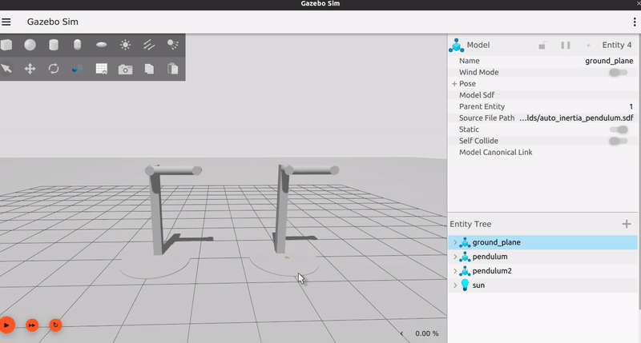
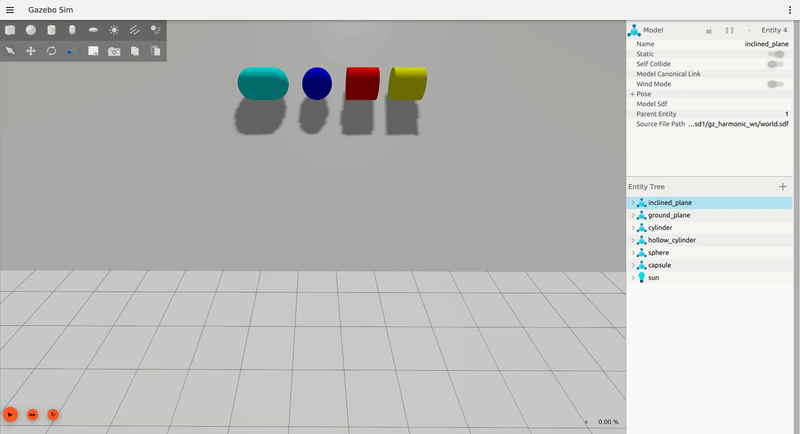

# GSoC'23 with Open Robotics

__Project: Automatically Compute Moments of Inertia for SDFormat Links__

__Mentors: Addisu Taddese (addisu@openrobotics.org), Dharini Dutia (dharini@openrobotics.org)__

<p float="left">
  
  
</p>

Hello Everyone,

This summer I was selected to work on `gz-sim` and `sdformat` as part of the Google Summer of Code Program 2023. My primary focus was the development of a feature enabling the automatic computation of Moments of Inertia for SDFormat Links in simulation.

Throughout the program, I worked closely with my esteemed mentors, Addisu Taddese and Dharini Dutia, to make substantial contributions to the `gz-sim` and `sdformat` libraries. I am grateful to Open Robotics for providing me with this opportunity and I'm truly appreciative of the invaluable guidance and support provided by my mentors. This GSoC journey has been an immensely enriching learning experience!"

## Overview
Setting physically plausible values for inertial parameters is crucial for an accurate simulation. However, these parameters 
are often complex to comprehend and visualize, and users may tend to enter wrong values leading to incorrect simulation. 
Therefore, native support for calculating inertial parameters through SDFormat specification would enable accurate simulations 
in simulators that use SDFormat.

Therefore, during the GSoC program this year, we have worked on implementing a feature for [libsdformat](https://github.com/gazebosim/sdformat)
that allows automatic calculation of Moments of Inertia for SDFormat links. 

This GitHub gist discusses about the motivation behind this feature and outlines the work that was done during the GSoC period.
This gist contains the following contents:
 * [Motivation behind the project](#Motivation)
 * [Project Summary along with some usage examples and demos](#Project-Summary)
 * [List of all PRs made and Issues opened during the period](#List-of-PRs-and-Issues)
 * [References](#References)
 * [About Me](#About-Me)

## Motivation
Currently, there are 2 major workflows used by the users to obtain the correct inertial parameters of their models:

 * Using CAD software like [Fusion360](https://www.autodesk.in/products/fusion-360/overview?term=1-YEAR&tab=subscription) or [Solidworks](https://www.solidworks.com/). Many users design their robot models using such CAD software which provides plugins that automatically generate the URDF/SDF for their model. Such plugins handle the calculation of the inertial parameters. For example, Fusion360 provides the [Fusion2URDF](https://github.com/syuntoku14/fusion2urdf) plugin which automatically generates a URDF with all the inertial parameters.

 * Another way is to use 3rd-party Mesh Processing Software like [Meshlab](https://www.meshlab.net/). Such software takes the mesh file as an input and provides the inertial parameters as an output which can then be copied and pasted into the URDF/SDF file. This is also the method that was suggested in official [Classic Gazebo docs](https://classic.gazebosim.org/tutorials?cat=build_robot&tut=inertia).

Both of these ways create a dependency on external software and might be complicated for beginners. In case the user doesn't provide any inertial values, a default Mass Matrix is used with `mass = 1.0` and `Diagonal Elements = (1, 1, 1)` which might not be best suited for all kinds of models. Native support for automatic inertia calculations directly into `libsdformat` would work as a better alternative to using the default values and facilitate the effortless generation of accurate simulations.

## Project Summary
This project enables automatic calculation for the Moments of Inertia, Mass, and
Inertial Pose (Center of Mass pose) of a link described using SDFormat. The following
Geometry types are currently supported with this feature:
 * Box
 * Capsule
 * Cylinder
 * Ellipsoid
 * Sphere
 * Mesh

Using this feature, a user can easily set up an accurate simulation with physically
plausible inertial values for a link. This also removes the dependency on manual calculations
or 3rd-party mesh processing software which can help lower the barrier of entry for beginners.

A new `auto` attribute for the `<inertial>` tag was introduced through the project which can be set
to true or false (The value is false by default) to enable or disable the automatic
calculations for a link respectively:

```xml
<inertial auto="true" />
```
In case, `auto` is set to true, the constituent **collision geometries** of the link are
considered for the calculations. A newly introduced `<density>` tag can be used to specify
the mass density value of the collision in kg/m^3. The density of water (1000 kg/m^3) is
utilized as the default value:

```xml
<collision name="collision">
  <density>2710.0</density>
  <geometry>
    <box>
      <size>1 1 1</size>
    </box>
  </geometry>
</collision>
```

In case of multiple collision geometries in a link, a user is free to provide different
density values for each and the inertia values from each would be aggregated to calculate
the final inertia of the link. However, if there are no collisions present,
an `ELEMENT_MISSING` error would be thrown.

It is **important** to note here that if `auto` is set to `true` and the user has
still provided values through the `<mass>`, `<pose>` and `<inertia>` tags, they
would be **overwritten** by the automatically computed values.

>**Note:** SDF Spec version 1.11 or greater is required to utilize the new tags and attributes
of this feature.

Existing `MassMatrix()` functions from the `gz-math` library were used for the 
inertia calculation of basic shapes (box, capsule, cylinder, ellipsoid, and sphere) 
and this functionality was integrated within `libsdformat` itself. 

On the other hand, a different approach was taken for the **mesh** geometry 
type since inertia calculations for 3D meshes can be complex and the preference 
for calculation method could vary for different users. A callback-based API was 
created that allows users to register their own custom inertia calculators. An 
integration-based numerical** method was implemented for computing the inertial 
properties of 3D meshes. It uses **Gauss’s Theorem** and **Greene’s Theorem** of 
integration to convert **volume integrals to surface integrals (Gauss’s Theorem)** 
and then **surface integrals to line integrals(Greene’s Theorem)**.<sup>[\[1\]](#References)</sup> 

### Some Key Points Regarding Mesh Inertia Calculator

Here are some key points to consider when using automatic inertia calculation with 3D Meshes:
 * Water-tight triangle meshes are required for the Mesh Inertia Calculator.
 * Currently, the mesh inertia is calculated about the mesh origin. Since the link
 inertia value needs to be about the Center of Mass, the mesh origin needs to be set
 at the Center of Mass (Centroid).
 * Since the vertex data is used for inertia calculations, a high vertex count would be
 needed for near-ideal values. However, it is recommended to use basic shapes with the
 geometry tag (Box, Capsule, Cylinder, Ellipsoid, and Sphere) as collision geometries to
 reduce the load of calculations. For eg: in [this](https://github.com/jasmeet0915/gz-sim/blob/jasmeet/custom_mesh_inerita_calculator/test/integration/mesh_inertia_calculation.cc) integration
test a cylinder mesh with 4096 vertices was used which resulted in inertia values withing a 0.005 tolerance of ideal.

## Demos
Let's have a look at some demos that would help you grasp a better understanding of the outcomes of this feature.

### Default vs. Automatically Computed Inertia Values
This demo shows 2 cylinders: one with default inertial values (right, green) and the other with automatic inertia calculations enabled (left, yellow). 

In this demo, we can see the difference between the inertia of both cylinders through the visualization enabled. The difference shows that the calculated values are more realistic for cylinders as compared to the default ones.

<details>
  <summary>SDF snippet for the yellow cylinder</summary>

  ```xml
    <model name="cylinder2">
      <pose>0 4 1 0 0 0</pose>
      <link name="cylinder_link">
        <inertial auto="true" />
        <collision name="collision">
          <density>1240.0</density>
          <geometry>
            <cylinder>
              <radius>1</radius>
              <length>2</length>
            </cylinder>
          </geometry>
        </collision>
        <visual name="visual">
          <geometry>
            <cylinder>
              <radius>1</radius>
              <length>2</length>
            </cylinder>
          </geometry>
          <material>
            <diffuse>1.0 1.0 0.0 1.0</diffuse>
            <ambient>1.0 1.0 0.0 1.0</ambient>
            <specular>1.0 1.0 0.0 1.0</specular>
          </material>
        </visual>
      </link>
    </model>
  ```
</details>


### Automatic Inertia Calculation for Links with Multiple Collisions 
This demo shows a model with a link having 2 collisions: a cube with a cylinder on top of it. 

Default values won't be a good choice in this scenario as we have seen in the previous demo and manually calculating the values would not be straightforward. Therefore, using the automatic inertia calculations we can easily get realistic inertial values for the compound shape.

<details>
  <summary>SDF snippet of the model in the demo</summary>

  ```xml
    <model name="compound_model">
      <pose>0 0 1.0 0 0 0</pose>
      <link name="compound_link">
        <inertial auto="true" />
        <collision name="box_collision">
          <pose>0 0 -0.5 0 0 0</pose>
	        <density>2.0</density>
          <geometry>
            <box>
              <size>1 1 1</size>
            </box>
          </geometry>
        </collision>
        <collision name="cylinder_compound_collision">
          <pose>0 0 0.5 0 0 0</pose>
          <density>4</density>
          <geometry>
            <cylinder>
              <radius>0.5</radius>
              <length>1.0</length>
            </cylinder>
          </geometry>
        </collision>

        <visual name="cylinder_visual">
          <pose>0 0 0.5 0 0 0</pose>
          <geometry>
            <cylinder>
              <radius>0.5</radius>
              <length>1.0</length>
            </cylinder>
          </geometry>
          <material>
            <ambient>1 1 0 1</ambient>
            <diffuse>1 1 0 1</diffuse>
            <specular>1 1 0 1</specular>
          </material>
        </visual>
        <visual name="box_visual">
          <pose>0 0 -0.5 0 0 0</pose>
          <geometry>
            <box>
              <size>1 1 1</size>
            </box>
          </geometry>
          <material>
            <ambient>1 0 0 1</ambient>
            <diffuse>1 0 0 1</diffuse>
            <specular>1 0 0 1</specular>
          </material>
        </visual>
      </link>
    </model>
  ```
</details>


### Pendulum Example World & Effect of Density
To understand the inertia calculation in links with multiple collisions and the
effect of setting different density values, you can launch the `auto_inertia_pendulum.sdf`
example world using:

```bash
gz sim auto_inertia_pendulum.sdf
```
After the gz-sim window opens up, you can right-click on both models and enable
the center of mass visualization by selecting the `View > Center of Mass` option from
the menu. Once you play the simulation it should look this:



This example world has two structurally identical models. The pendulum link of both
models contains 3 cylindrical collision geometries: One on the top which forms the
joint, One in a longer cylinder in the middle, and One at the end which forms the bob of
the pendulum. Even, though they are identical, the center of mass for both are different
as they use different density values for the different cylinder collisions. On one
hand, the upper joint collision of the pendulum on the left has the highest density
which causes the center of mass to shift closer to the axis while on the other hand,
the bob collision of the pendulum on the right has the highest density which causes
the center of mass to shift towards the end of the pendulum.
This difference in mass distribution about the axis of rotation results in a difference
in the moment of inertia of the 2 setups and hence different angular velocities.

### Mesh Inertia Calculation Example with Rubber Ducky 3D Mesh
This demo shows the automatic inertia calculation feature on a rubber ducky 
model which is a non-convex mesh. On the left, we have the rubber ducky mesh 
with automatic calculations enabled and on the right, the mesh uses the default values.
> **Note:** The inertial values are due to the scale of the mesh. You can
see the banana for scale in between the 2 ducks. A density value for the duck
was used which was calculated by using the mass and volume data of the duck found online.

<details>
  <summary>SDF snippet for the duck mesh with auto inertial</summary>

  ```xml
<?xml version="1.0" ?>
<sdf version="1.6">
  <model name="duck">
    <link name="duck_link">
      <pose>0 0 0 0 0 0</pose>
      <inertial auto="true" />
      <collision name="duck_collision">
      	<pose>0 0 0 0 0 0</pose>
        <density>111.8</density>
        <geometry>
          <mesh>
            <uri>meshes/duck_collider.dae</uri>
          </mesh>
        </geometry>
      </collision>
      <visual name="duck_visual">
        <pose>0 0 0 0 0 0</pose>
        <geometry>
          <mesh>
            <uri>meshes/duck.dae</uri>
          </mesh>
        </geometry>
      </visual>
    </link>
    <static>true</static>
  </model>
</sdf>
  ```
</details>


### Mesh Inertia Calculation with Rolling Shapes Demo

Let's try another example world, `auto_inertia_rolling_shapes.sdf`. This can be
launched with `gz sim` using the following command:

```bash
gz sim auto_inertia_rolling_shapes.sdf
```

Once you launch and play the simulation, it should look something like this:



Here the right most shape is a hollow cylinder (yellow). This model is loaded from
fuel and is made using a collada mesh of a hollow cylinder. Apart from this, we can
see there is a solid cylinder, a solid sphere, and a solid capsule. All of these are
made using the `<geometry>` tag and have automatic inertia calculations enabled.
Here, the moments of inertia for the hollow cylinder (which is convex mesh shape) is
calculated and from the simulation, we can see that it reaches the bottom of the
incline last. This is physically accurate as the mass distribution for the hollow
cylinder is concentrated at a distance from the axis of rotation (which passes through
the center of mass in this case).

## List of PRs
 <table>
  <tr>
    <td align="center"><b>Pull Requests</b></td><td align="center"><b>Repository</b></td><td><b>Status</b></td>
  </tr>
  <tr>
    <td><a href="https://github.com/gazebosim/sdformat/pull/1299">Automatic Moment of Inertia Calculations for Basic Shapes</a></td>
    <td><a href="https://github.com/gazebosim/sdformat">sdformat</a></td>
    <td>Merged</td>
  </tr>
  <tr>
    <td><a href="https://github.com/gazebosim/sdformat/pull/1304"> Callback-based API for Implementing Custom Moment of Inertia Calculators for Meshes</a></td>
     <td><a href="https://github.com/gazebosim/sdformat">sdformat</a></td>
    <td>Merged</td>
  </tr>
  <tr>
    <td><a href="https://github.com/gazebosim/gz-sim/pull/2061">Added Mesh Moment of Inertia Calculator</a></td>
    <td><a href="https://github.com/gazebosim/gz-sim">gz-sim</a></td>
    <td>Merged</td>
  </tr>
  <tr>
    <td><a href="https://github.com/gazebosim/sdformat/pull/1298">Copy 1.10 spec to 1.11 for sdformat14</a></td>
     <td><a href="https://github.com/gazebosim/sdformat">sdformat</a></td>
    <td>Merged</td>
  </tr>
  <tr>
    <td><a href="https://github.com/gazebosim/sdf_tutorials/pull/92">Proposal for Automatic Calculation of Moments of Inertia for SDFormat Links</a></td>
    <td><a href="https://github.com/gazebosim/sdf_tutorials">sdf_tutorials</a></td>
    <td>Merged</td>
  </tr>
  <tr>
    <td><a href="https://github.com/gazebosim/gz-sim/pull/2119">Added tutorial for Automatic Inertia Calculator</a></td>
    <td><a href="https://github.com/gazebosim/gz-sim">gz-sim</a></td>
    <td>Open</td>
  <tr>
    <td><a href="https://github.com/gazebosim/gz-math/pull/538">Added std::optional MassMatrix() functions for Box, Cylinder & Sphere</a></td>
    <td><a href="https://github.com/gazebosim/gz-math">gz-math</a></td>
    <td>Merged</td>
  </tr>
  <tr>
    <td><a href="https://github.com/gazebosim/sdformat/pull/1292">Updated findfile() to search localpath first</a></td>
    <td><a href="https://github.com/gazebosim/sdformat">sdformat</a></td>
    <td>Merged</td>
  </tr>
 <table>

## Future Plans
During the project, most of our goals were satisfied and the desired results were obtained.
However, there are some things that need to be developed for a better workflow:
 * Link level `<density>` and `<auto_inertial_params>` tags were added but their functionality
was not implemented. It would be good to provide users with the ability to provide
density values for the whole link instead of copying the same values for each collision.
 * Currently, the mesh origin needs to be set at the geometric center (centroid) for correct
inertia values. Since there are many cases where the mesh origin might be set elsewhere, it would
be good to have a functionality that can transform the computed inertia tensor to the mesh centroid
in such a case.

## References
 * \[1\]: https://www.geometrictools.com/Documentation/PolyhedralMassProperties.pdf
   
## About Me
Jasmeet is a recent Electronics and Communications Engineering graduate hailing from India. He has a strong passion for robotics and aspires to become a Roboticist. His primary areas of interest lie in robot perception, robotic simulations, and mechatronics. Over the course of two years, Jasmeet has gained valuable experience in robotics development with ROS, which he acquired through participating in various competitions, personal projects, and internships. 

Additionally, he holds the position of co-founder in a Robotics Research and Development Society called [A.T.O.M Robotics Lab](https://github.com/atom-robotics-lab) at his college. Apart from his dedication to robotics, Jasmeet also possesses a keen enthusiasm for Embedded Systems, PCB Designing, and 3D Printing. He frequently combines these interests to build hobby projects and eagerly [shares](https://www.instructables.com/member/Jasmeeet%20Singh/) his projects with the community. In his free time, Jasmeet enjoys engaging in sketching, painting, and reading sci-fi novels.
